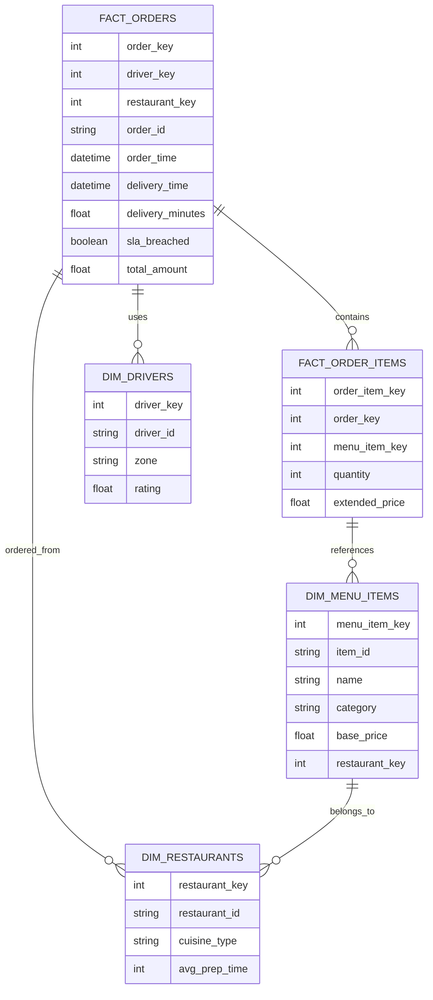

```mermaid
erDiagram
    FACT_ORDERS ||--o{ FACT_ORDER_ITEMS : contains
    FACT_ORDERS ||--o{ DIM_DRIVERS : uses
    FACT_ORDERS ||--o{ DIM_RESTAURANTS : ordered_from
    FACT_ORDER_ITEMS ||--o{ DIM_MENU_ITEMS : references
    DIM_MENU_ITEMS ||--o{ DIM_RESTAURANTS : belongs_to

    FACT_ORDERS {
        int order_key
        int driver_key
        int restaurant_key
        string order_id
        datetime order_time
        datetime delivery_time
        float delivery_minutes
        boolean sla_breached
        float total_amount
    }

    FACT_ORDER_ITEMS {
        int order_item_key
        int order_key
        int menu_item_key
        int quantity
        float extended_price
    }

    DIM_DRIVERS {
        int driver_key
        string driver_id
        string zone
        float rating
    }

    DIM_RESTAURANTS {
        int restaurant_key
        string restaurant_id
        string cuisine_type
        int avg_prep_time
    }

    DIM_MENU_ITEMS {
        int menu_item_key
        string item_id
        string name
        string category
        float base_price
        int restaurant_key
    }


```